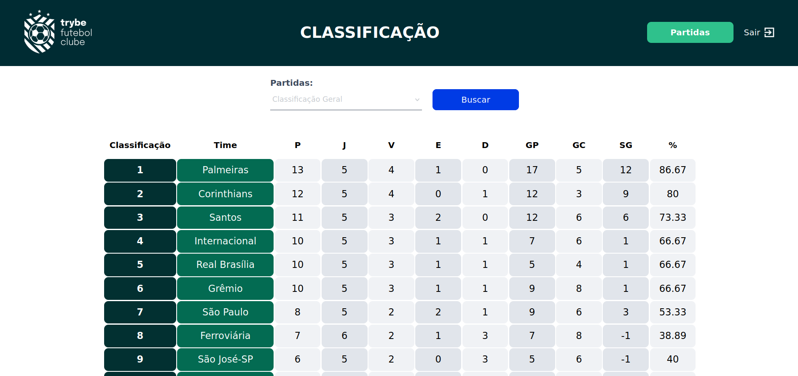
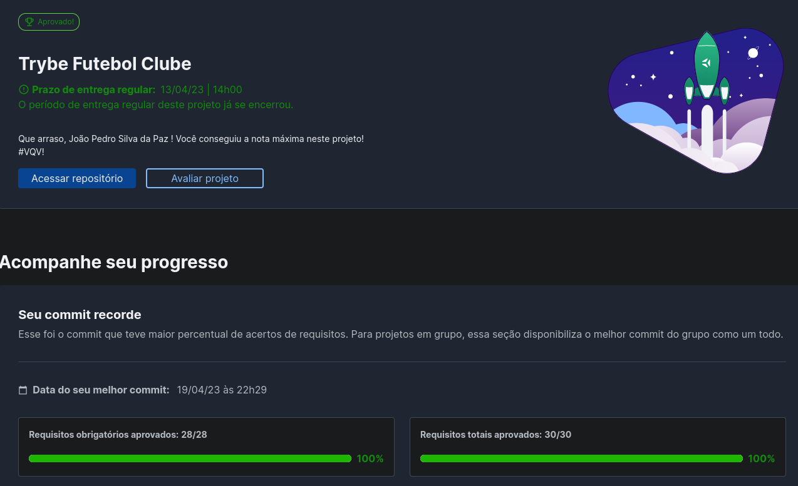

# Trybe Futebol Clube

O TFC é um site informativo sobre partidas e classificações de futebol. Nele, é possível acompanhar, alterar e criar novas partidas, além de conferir a classificação e o desempenho dos times. Fui responsável pelo desenvolvimento da parte do back-end, onde criei um ambiente dockerizado e utilizei a modelagem de dados do MySQL por meio do Sequelize. Assim, construí a API responsável por alimentar a parte do Front End.

## Tecnologias/Ferramentas usadas
 <ul>
  <li>Mysql</li> 
  <li>MySQL Workbench</li> 
  <li>Sequelize</li> 
  <li>Express</li> 
  <li>TypeScript</li> 
  <li>Node</li> 
  <li>Docker</li>
  <li>Joi</li>
  <li>Mocha</li>
  <li>Sinon</li>
  <li>Chai</li>
  <li>JSON Web Tokens</li>
 </ul>

## Como rodar o projeto
1 - Clone o projeto: `git clone git@github.com:joaopedrospaz/trybe-futebol-clube.git`
 
2 - Entre na pasta app: `cd trybe-futebol-clube/app`
 
3 - Suba o Container: `docker-compse up -d`
 
4 - Acesse do seu navegador: `http://localhost:3000` 

## Nota do Projeto

 
<strong>Nota</strong>

 

 
 

